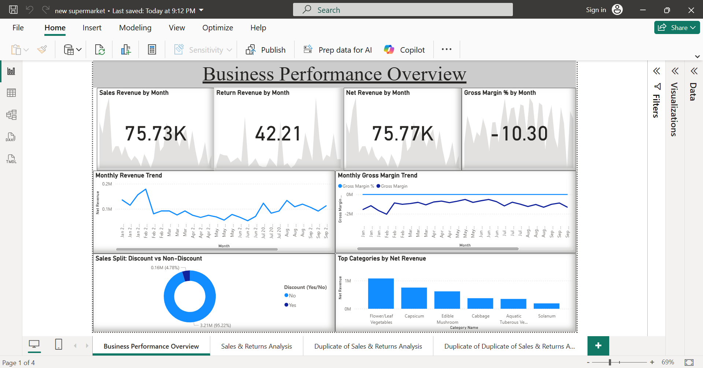
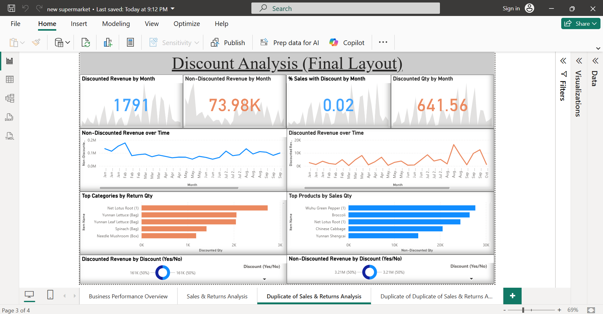
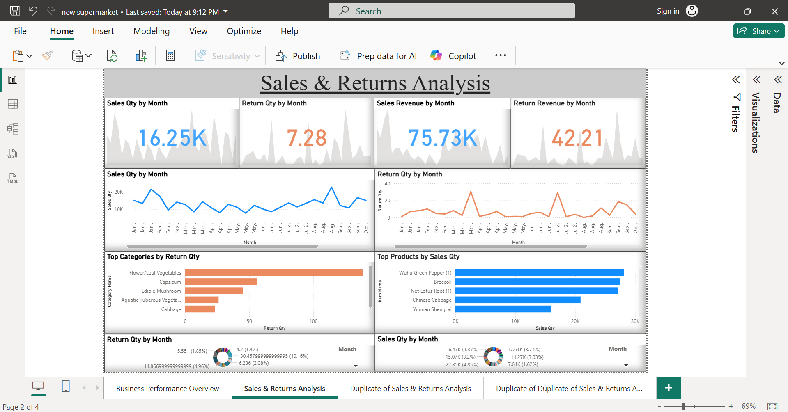

# 🛒 Retail Sales Dashboard & Analysis

This repository contains two projects based on **Retail Sales Data**:  
1. **Power BI Dashboard** → Interactive visualization, KPIs & insights  
2. **Jupyter Notebook (Python)** → Data cleaning, revenue & discount analysis

## 📊 Power BI Dashboard
- File: `supermarket_analysis_dashboard.pbix`  
- Features:
  - Revenue, Profit, Discount KPIs  
  - Region & Category analysis  
  - Interactive filters

📸 **Screenshots**

## 🐍 Jupyter Notebook (Python)
- File: `Retail_Sales_Revenue_Discount_Analysis.ipynb`  
- Key Steps:
  - Data Cleaning (Pandas, NumPy)  
  - Exploratory Data Analysis (Matplotlib, Seaborn)  
  - Revenue vs Discount insights 
